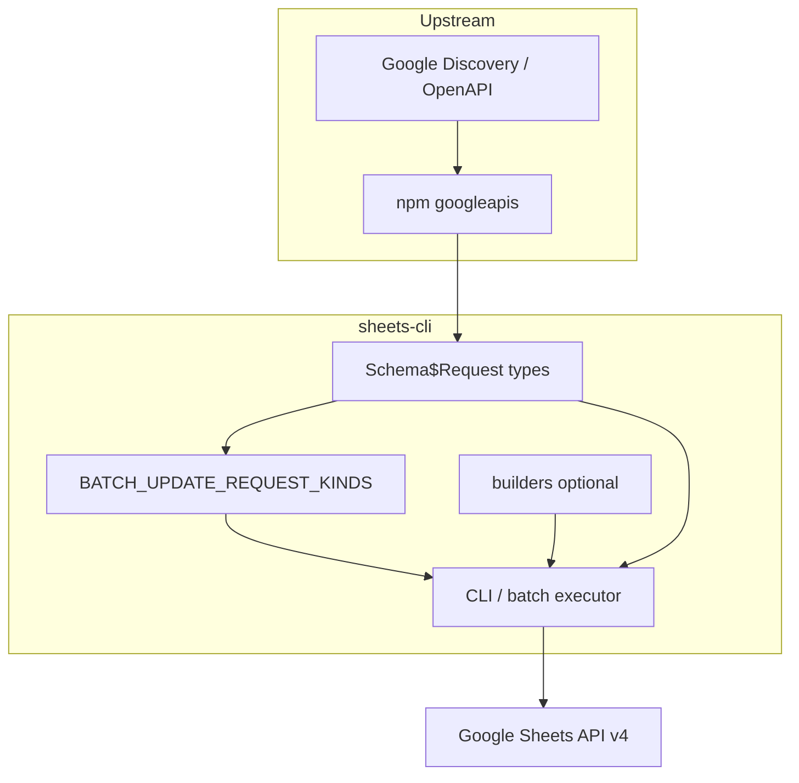

# Привязка к Google Sheets API

## Источник истины

| Слой | Что используем | Дублируем? |
|------|----------------|------------|
| HTTP + типы | [`googleapis`](https://www.npmjs.com/package/googleapis) (`sheets` v4) | Нет — клиент и `Schema$*` из Discovery/OpenAPI |
| Список `batchUpdate` subrequests | `BATCH_UPDATE_REQUEST_KINDS` в [`src/api/request-types.ts`](../src/api/request-types.ts) | **Да, но синхронизируется** с `Schema$Request` из googleapis |
| Удобные payload | [`src/builders/`](../src/builders/) | Да — наш слой; опционален при `request run` / `batch-raw` |
| Табличная семантика | [`src/sheets.ts`](../src/sheets.ts) | Да — продуктовый слой поверх API |
| Список файлов-таблиц | [`src/sheets/drive-spreadsheets.ts`](../src/sheets/drive-spreadsheets.ts) → Drive `files.list` | Нет дублирования API; только query builder |

Мы **не** парсим сайт Google. Типы в `node_modules/googleapis/build/src/apis/sheets/v4.d.ts` генерируются из официального Discovery Document при релизе пакета `googleapis`.

## Как не отстать от API

1. **Compile-time:** `request-types.ts` использует `as const satisfies ReadonlyArray<keyof sheets_v4.Schema$Request>` и assert-тип — лишние/пропущенные kinds ломают `bun run typecheck`.
2. **CI:** [`src/__tests__/api/googleapis-sync.test.ts`](../src/__tests__/api/googleapis-sync.test.ts) сравнивает реестр с ключами из установленного `googleapis`.
3. **После bump `googleapis`:**  
   `bun scripts/generate-request-kinds.ts` — перегенерировать список kinds (отсортирован по алфавиту).
4. **Локально:** `sheets-cli doctor api` — та же проверка + версия пакета.

## Что не автоматизируем

- **Builders** и dedicated CLI — осознанные обёртки; новый kind в API можно вызывать сразу через `request run` без нового builder.
- **Поведение API** (квоты, ошибки) — только через живые тесты (`SHEETS_CLI_INTEGRATION=1`) и bump зависимости.

## Схема

